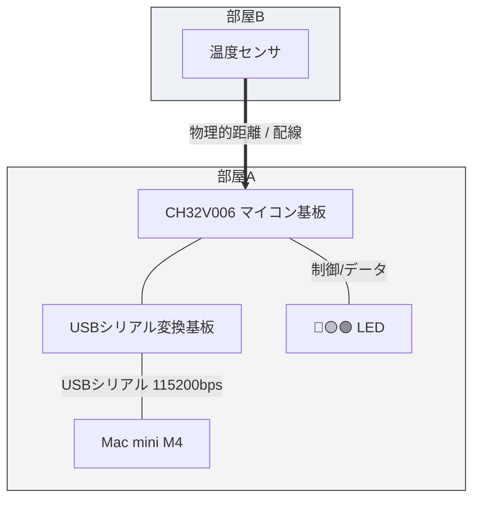
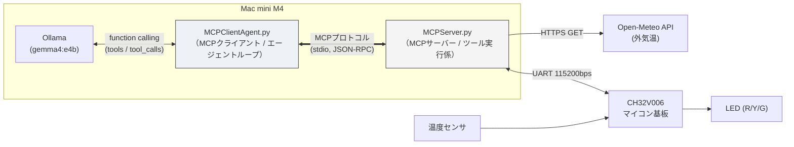
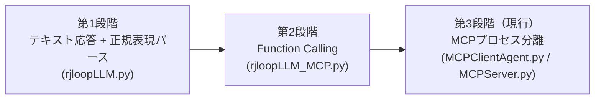
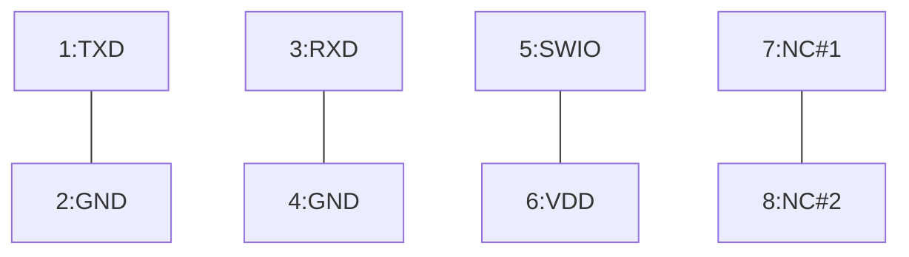
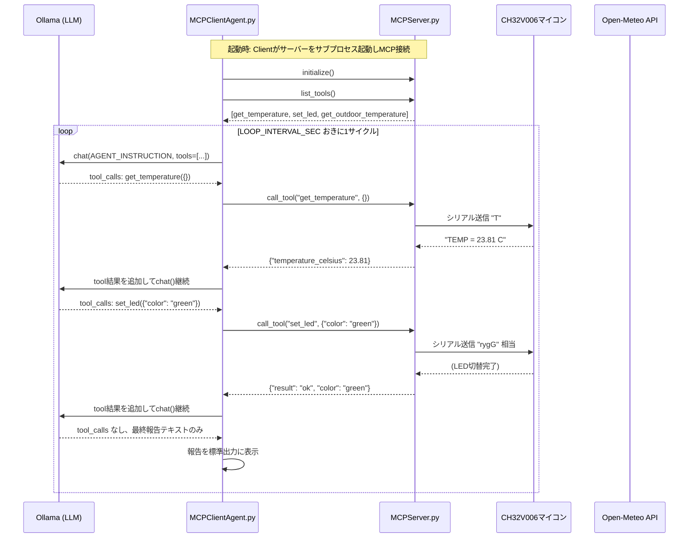

# Real Junk（マジ、くっだらねーっ）システムドキュメント

**フィジカルAI実験システム — MCP版 エージェントループ解説**

- プロジェクト名: Real Junk（略称: RJ）
- 目的: 組み込み屋の視点から、リアルなハードウェアを用いてAIエージェントの仕組みを理解する
- 対象読者: 本システムのコードを読み、動作を理解し、改良・機能追加/削除を行いたい人
- 発表: しない（個人の学習用実験）

---

## 1. なぜこれを作ったか（背景思想）

### 1.1 「AIエージェント」と「フィジカルAI」はどう違うのか

開発の出発点には、次のような疑問があった。

> 最近よく聞く「フィジカルAI」という言葉は、人工知能にペリフェラルを持たせるという意味で、自分がやろうとしている「組み込み屋から見たAIエージェント」と似ている気がする。両者は明確に別物なのか、それとも一方が他方を包含するのか。

整理すると、両者は対立概念ではなく、**包含関係にある**。

| 概念 | 位置づけ |
|---|---|
| AIエージェント | 目標を与えられ、自ら思考・計画し、ツール（API/関数）を使ってタスクを完結させる「仕組み・アーキテクチャ」全体。活躍の場はPCの中（Excel分析やメール文面作成など）のデジタル空間で完結することも多い。 |
| フィジカルAI | AIの知能（脳）が、現実世界のセンサー・アクチュエータ（身体・ペリフェラル）と直結し、物理法則や摩擦・誤差を伴う環境で動くシステム全般。自動運転車、ヒューマノイド、工場内AGV、そして本プロジェクトの「マイコン経由の温度センサ＆LED制御」もここに含まれる。 |

つまり、**フィジカルAIはAIエージェントの一形態（実践的な特化版）**であり、AIエージェントという大枠の中で、ツールの実行先がWeb APIやDBではなく「現実世界のハードウェア（マイコン、モーター、センサー）」に向いたものが、昨今「フィジカルAI」と呼ばれている。本システムは、AIエージェントの概念をチャット画面から引きずり出し、シリアル通信という物理レイヤーに接続する試みそのものであり、まさにフィジカルAIの最小構成に位置づけられる。

### 1.2 組み込み屋から見た本質

バズワードとしての「フィジカルAI」は大げさなヒューマノイドや自動運転車を連想させがちだが、実態は組み込み屋が昔からやってきた**「センシングとフィードバック制御」の延長線上**にある。違いがあるとすれば、これまで「人間が書いたif-elseの固いロジック」で担っていたセンサー値→アクチュエータ制御の判断部分に、「文脈を理解し、不確実な状況でも判断を下せるLLMという柔軟な脳ミソ」を組み込んだ点である。

「温度が高かったらどうするか」を定数の閾値で縛るのではなく、AIに判断させる——これが本プロジェクトの一貫したモチベーションであり、目標は「Excelが自動で埋まる」式の紹介的な理解ではなく、**AIエージェントの本質を第一原理から体感すること**にある。

---

## 2. システム全体構成

### 2.1 物理構成



- マイコン: **CH32V006**（WCH RISC-V系）
- 信号経路: シリアル(UART) 115,200 baud
- マイコン基板コネクタ配線: 1:TXD / 2:GND / 3:RXD / 4:GND / 5:SWIO / 6:VDD / 7,8:NC

### 2.2 ソフトウェア構成（現行版）

現行版は3層構成になっている。**Mac側は「MCPクライアント（LLMエージェント）」と「MCPサーバー（ツール実行係）」の2プロセスに分離**され、標準入出力(stdio)経由でMCPプロトコルによって通信する。



**ポイント:**

- `MCPClientAgent.py` は `MCPServer.py` を **サブプロセスとして起動**し、stdio経由でMCP接続する（`StdioServerParameters(command="python3", args=["MCPServer.py"])`）。つまり `MCPServer.py` を単体で先に起動しておく必要はない。
- LLM（Ollama, `gemma4:e4b`）は、実際にどのツールをどの順で呼ぶかを**自分で判断**する。Python側は「呼ばれた通りに実行して結果を返すだけ」の取り次ぎ役に徹している。
- サーバーが公開するツール一覧（`get_temperature` / `set_led` / `get_outdoor_temperature`）は**実行時に動的取得**され、Ollamaの`tools`形式に変換される。人間がツール定義を手で書き写す必要がない。

---

## 3. 設計の変遷（なぜMCPまで来たか）

本システムは3段階で進化してきた。現行コード（MCPClientAgent.py / MCPServer.py）を理解するうえで、この変遷を知っておくと設計意図が掴みやすい。



| 段階 | 特徴 |
|---|---|
| ① テキスト応答＋正規表現 | プロンプトで「`color:` を含む2行だけ返して」とお願いし、返ってきた自由文をPython側で正規表現でこじ開けて解釈。温度はPythonが先に取得してからLLMに渡す**固定順序**。 |
| ② Function Calling | `get_temperature`・`set_led` を description 付きのツール（`TOOLS`）として定義。LLMには温度の数値を渡さず、「まず温度を確認してから、必要なら色を変えて」とだけ指示。**「温度を確認するかどうか」自体もLLMの判断に委ねる**ようになった。無限ループ防止に `MAX_AGENT_TURNS` を導入。ただしツール実体は同一プロセス内のPython関数呼び出し。 |
| ③ MCPプロセス分離（現行） | ツールの実体を**独立したMCPサーバープロセス**に切り出した。クライアント側は関数の中身を一切知らなくても、MCPプロトコル越しに「ツール名・description・引数スキーマ」だけを頼りに使える。段階②までの `run_agent_step()` 内でのPython関数直接呼び出しが、`session.call_tool()` によるプロセス間通信に置き換わった。LLM自身から見た呼び方（tools定義）は段階②と変わらない。 |

---

## 4. ハードウェア仕様

### 4.1 マイコン基板シリアルコマンド一覧

| コマンド | 意味 | 備考 |
|---|---|---|
| `#` | 休止(msec) | 変更可能 |
| `#=n` | 休止(msec)指定 | 例: `#=300` |
| `R` | 🔴赤LED点灯 | |
| `r` | 🔴赤LED消灯 | |
| `Y` | 🟡黄LED点灯 | |
| `y` | 🟡黄LED消灯 | |
| `G` | 🟢緑LED点灯 | |
| `g` | 🟢緑LED消灯 | |
| `T` | 温度測定 | 応答: `TEMP = 23.43 C` |

- コマンドは連続記述可能。改行まで解釈と実行を継続する。
  - 例（200msec間隔で赤LEDを3回点滅）: `#=200R#r#R#r#R#r#`（末尾に改行）
- コマンド応答にはデバッグメッセージが混じるため、LED系コマンドの応答は単純に無視してよい。`T`コマンドの応答は先頭の `'TEMP = '` を手がかりに抽出すること（`MCPServer.py` の `get_temperature()` 参照）。

### 4.2 マイコン基板 ⇔ エミュレータ接続ピン



---

## 5. ソフトウェア詳細

### 5.1 MCPServer.py — ツール実行係

**役割:** シリアル通信・気象API呼び出しといった「実際の作業」を担う。MCPプロトコルでツールを公開するだけで、クライアント側の実装（どのLLMを使うか等）には一切依存しない。

**公開ツール一覧:**

| ツール名 | 概要 | 戻り値 |
|---|---|---|
| `get_temperature()` | シリアルで `T` コマンドを送信し、マイコンから室温を取得 | `{"temperature_celsius": float}` または `{"error": str}` |
| `set_led(color)` | 指定色（`red`/`yellow`/`green`）のLEDを点灯し他を消灯 | `{"result": "ok", "color": str}` または `{"error": str}` |
| `get_outdoor_temperature()` | Open-Meteo APIから現在の外気温を取得（APIキー不要） | 文字列（例 `"22.6度"`）、失敗時は `"不明"` |

**実装上の重要ポイント:**

- シリアルポートは**サーバー起動時ではなく初回アクセス時に遅延オープン**する（`_get_serial()`）。これはサーバープロセスが起動しただけでマイコンをリセットしてしまうのを避けるための設計。
- `get_temperature()` は最大3秒間シリアル応答を待ち、`"TEMP = "` で始まる行を見つけるまで読み進める。タイムアウト時はエラー辞書を返す（例外を投げない）。
- `set_led()` はLED3色すべてのON/OFFコマンドを一括生成して1回のシリアル書き込みで送る（例: `green` 指定時は `rYg` ではなく `rygG`のような形で、対象色だけON、他はOFF）。
- `get_outdoor_temperature()` は例外を握りつぶし、失敗時も `"不明"` を返すことでループ全体を止めない設計になっている。

### 5.2 MCPClientAgent.py — MCPクライアント／LLMエージェントループ

**役割:** ローカルLLM（Ollama）に対してツール一覧を提示し、LLM自身が「まず温度を確認し、その結果を踏まえてLEDを切り替える」という手順を組み立てるのを見守り、実行を仲介する。

**主要な流れ（`main()`）:**

1. `stdio_client(SERVER_PARAMS)` で `MCPServer.py` をサブプロセス起動し、stdio経由で接続
2. `ClientSession` を初期化 (`session.initialize()`)
3. `session.list_tools()` でサーバーが公開するツール一覧を取得
4. `mcp_tools_to_ollama_format()` でOllamaの `tools` 引数形式に変換
5. `LOOP_INTERVAL_SEC`（デフォルト3600秒＝1時間）ごとに `run_agent_step()` を呼び、エージェントに1サイクル動作させる
6. Ctrl-Cで終了

**`run_agent_step()` の内部ロジック:**

- `AGENT_INSTRUCTION` を最初のユーザーメッセージとしてOllamaに渡す
- `MAX_AGENT_TURNS`（デフォルト5）を上限に、以下を繰り返す:
  1. `ollama.chat()` を呼ぶ
  2. 応答に `tool_calls` が含まれなければ、その `content` を最終報告として返す
  3. `tool_calls` があれば、各呼び出しについて `session.call_tool(name, args)` で **MCPサーバーに実行を依頼**（ここが旧版との最大の違い。旧版はPython関数を直接呼んでいた）
  4. ツール実行結果を `role: "tool"` メッセージとして会話履歴に追加し、次のターンへ
- 上限ターンに達した場合は `"(上限回数に達したため打ち切りました)"` を返す

### 5.3 シーケンス図（1サイクルの動作）



**補足:** 実行例（readme.md記載）では、外気温はループ本体側で `get_outdoor_temperature` 相当の値をプロンプト外文脈として表示しているが、`AGENT_INSTRUCTION` 自体はLLMに対して `get_temperature` と `set_led` の使用のみを指示している（詳細は後述「6. 既知の相違点」参照）。

---

## 6. 既知の相違点・today's TODO

コードを読む中で気づいた、readme.mdの説明や設計意図とコード実態がずれていそうな箇所を挙げる。改良の着手点として参考にしてほしい。

1. **`get_outdoor_temperature` は実装途中（未着手機能）**
   `MCPServer.py` にはこのツールが定義され、MCPサーバーのツール一覧としてクライアントにも見えているが、`MCPClientAgent.py` の `AGENT_INSTRUCTION` は「`get_temperature` → `set_led`」の2ステップしか明示的に指示していない。これは実装漏れではなく、**「外気温をエージェントの判断ループに組み込もうと着手したところで時間切れになった」状態**である。具体的な追加実装手順は別冊「機能追加マニュアル」にまとめた。

2. **`LLM_MODEL = "gemma4:e4b"` について**
   これは表記ミスではなく、本ドキュメント作成時点の学習データにはまだ存在しなかった、Googleの最新LLMを指している。実際に使用する際はOllama側で当該モデルが利用可能か（`ollama list` 等で）確認すること。

3. **readme.md記載のファイル名との不一致**
   readme.md本文中では `rjloopLLM.py` / `rjloopLLM_MCP.py` という名称で説明されているが、添付コードは `MCPClientAgent.py` / `MCPServer.py` にリネームされている（本ドキュメントは添付コードを正としている）。両者は「第2段階→第3段階」への進化に対応しており、機能的にはより発展した実装が現行版である。

4. **`WEATHER_LATITUDE` / `WEATHER_LONGITUDE` のデフォルト地点**
   `MCPServer.py` 内のコメントでは「北海道岩見沢市付近」と記載されているが、readme.md本文の解説では「習志野市付近に仮設定」と説明されている箇所がある。実際の緯度経度定数値（`43.21..., 141.74...`）は岩見沢市付近のものであり、コード側が実態。使用環境に応じて定数を書き換える必要がある。

5. **`SERIAL_PORT` のハードコード**
   `/dev/tty.usbmodemBDD28F0643042` のようにデバイスパスが固定値でハードコードされている。macOSではUSBポート抜き差しやマイコン基板の個体によってこのパスが変わることがあるため、環境変数化や自動検出（`serial.tools.list_ports` の活用等）が改良候補になる。

---

## 7. 設定パラメータ一覧

| パラメータ | 定義場所 | デフォルト値 | 説明 |
|---|---|---|---|
| `LLM_MODEL` | MCPClientAgent.py | `"gemma4:e4b"` | Ollamaで使用するモデル名（要確認、6-2参照） |
| `MAX_AGENT_TURNS` | MCPClientAgent.py | `5` | 1サイクルあたりのツール呼び出し往復回数の上限（暴走防止） |
| `LOOP_INTERVAL_SEC` | MCPClientAgent.py | `3600` | エージェントを何秒おきに1サイクル動かすか |
| `AGENT_INSTRUCTION` | MCPClientAgent.py | （固定文） | LLMへの最初の指示文。エージェントの振る舞いを変える最も直接的な変更点 |
| `SERIAL_PORT` | MCPServer.py | `/dev/tty.usbmodemBDD28F0643042` | マイコンとの接続デバイスパス（環境依存、要変更） |
| `BAUD_RATE` | MCPServer.py | `115200` | シリアル通信速度 |
| `WEATHER_LATITUDE` / `WEATHER_LONGITUDE` | MCPServer.py | `43.21...` / `141.74...` | 外気温取得地点の緯度経度 |
| `LED_COMMANDS` | MCPServer.py | `red/yellow/green` の3色 | LED色とマイコンコマンドの対応辞書。色を追加する際はここを拡張 |

---

## 8. 実行方法

```bash
# 1. 依存ライブラリのインストール（バージョン固定に注意）
pip install "mcp[cli]<2" ollama pyserial

# 2. ローカルLLMサーバーを起動しておく（別ターミナル）
ollama serve

# 3. エージェントを起動
#    MCPClientAgent.py が MCPServer.py を自動でサブプロセス起動するため、
#    MCPServer.py を単体で先に起動しておく必要はない
python3 MCPClientAgent.py
```

**単体テスト時（MCPServer.py単体の動作確認）:**

```bash
mcp dev MCPServer.py
```

MCP Inspector から `get_temperature` / `set_led` / `get_outdoor_temperature` を個別に叩いて動作確認できる。

---

## 9. 拡張ガイド（改良の入り口）

本システムは「ツールを追加する」「エージェントの判断基準を変える」の2方向で拡張しやすい構造になっている。

### 9.1 新しいツールを追加したい場合

`MCPServer.py` に `@mcp.tool()` デコレータ付きの関数を追加するだけでよい。クライアント側の変更は基本的に不要（`list_tools()` で自動的に検出される）。ただし、LLMに積極的に使わせたい場合は `AGENT_INSTRUCTION`（MCPClientAgent.py）に明示的な誘導文を加えるとよい（6-1の既知の相違点と同じ理由）。

```python
@mcp.tool()
def get_humidity() -> dict:
    """室内の湿度センサから現在の湿度（%）を取得する。"""
    # マイコン側に対応コマンドを追加した上で実装
    ...
```

### 9.2 LEDの判断ロジックを変えたい場合

現行版はLED色の決定基準をLLMの自由判断に委ねており、コード上に閾値ロジックは存在しない（`AGENT_INSTRUCTION` の文面だけが判断材料）。判断基準を変えたい場合は、まず `AGENT_INSTRUCTION` の文面を変更するのが最も手軽な入り口になる。より厳密な制御をしたい場合は、`set_led` ツールのdescriptionに条件を書き込む、あるいはPython側で許容範囲チェックを追加するといった段階的な制御も選択肢になる。

### 9.3 色を増やしたい場合

`MCPServer.py` の `LED_COMMANDS` 辞書に色とON/OFFコマンドの組を追加し、マイコン側のファームウェアで対応するLED制御コマンドを実装する必要がある（本ドキュメント時点ではハードウェア側は赤・黄・緑の3色構成）。

### 9.4 外気温を判断に組み込みたい場合

6-1で述べた通り、`get_outdoor_temperature` ツール自体はすでに存在するが、エージェントの判断ループへの接続は未着手である。この具体的な実装手順は、本システムへの機能追加の典型例として、別冊「**RealJunk_機能追加マニュアル.md**」にまとめた。

---

## 10. トラブルシューティング

| 症状 | 想定原因 | 対処 |
|---|---|---|
| `get_temperature` が毎回エラーを返す | シリアルポートが繋がっていない／`SERIAL_PORT` の値が実機と不一致 | `ls /dev/tty.*` 等でデバイスパスを確認し、`MCPServer.py` の定数を修正 |
| マイコンが起動直後にリセットされてしまう | シリアルポートオープン時のDTR/RTS制御によるリセット | `_get_serial()` の遅延オープン設計により基本的に緩和されているが、`time.sleep(2)` のリセット待ちを延長するなど調整余地あり |
| LLMがツールを全く呼ばない | `AGENT_INSTRUCTION` の文面が曖昧、または指定モデルがFunction Calling非対応 | 指示文をより具体的にする／Ollamaでツール呼び出しに対応したモデルか確認する |
| `外気温: 不明` が続く | Open-Meteo APIへの通信失敗（ネットワーク不通・タイムアウト） | `get_outdoor_temperature()` のtimeout値を調整、ネットワーク疎通を確認（処理自体は例外を握りつぶして継続する設計なのでループは止まらない） |
| 上限回数で打ち切られる報告が続く | `MAX_AGENT_TURNS` が小さすぎる、またはLLMがツール呼び出しループから抜けられない | `MAX_AGENT_TURNS` を増やす／`AGENT_INSTRUCTION` に完了条件を明記する |

---

## 11. 用語・略語

| 用語 | 説明 |
|---|---|
| MCP | Model Context Protocol。LLMとツール（外部機能）を疎結合に接続するためのプロトコル。本システムではstdio上のJSON-RPCとして実装されている |
| Function Calling | LLMが会話の中で「この関数をこの引数で呼びたい」という意思表示を構造化データとして返す仕組み |
| Perceive→Reason→Act | 知覚→推論→行動のループ。本システムでは 温度取得(Perceive) → LLMの判断(Reason) → LED制御(Act) に対応する |
