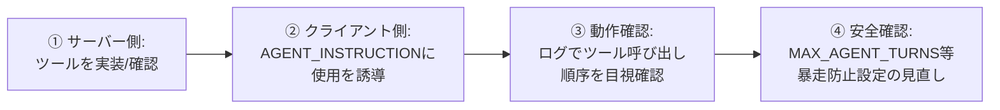
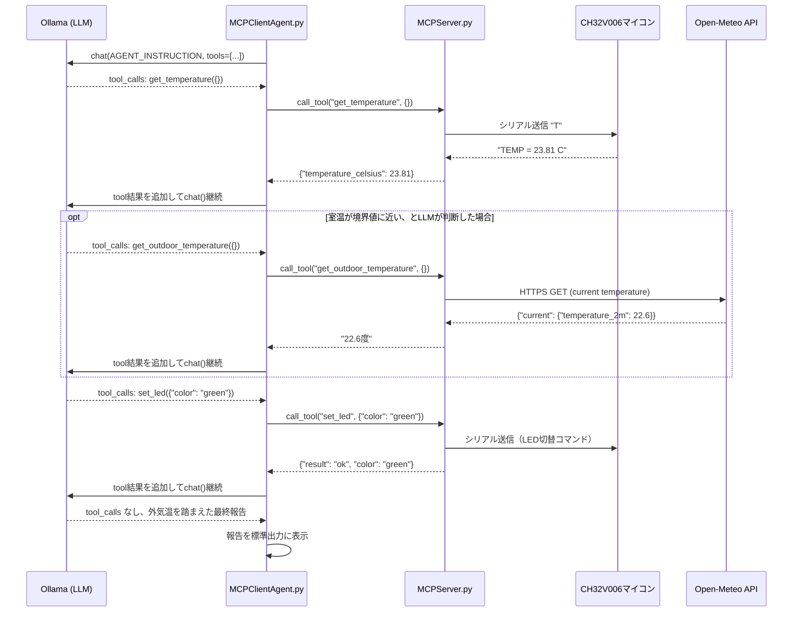

# RealJunk 機能追加マニュアル（別冊）

本ドキュメントは「RealJunk_システムドキュメント.md」の別冊です。本編9章「拡張ガイド」の実践編として、**本システムに新しい機能を追加する際の一般手順**と、その具体例として**未着手のまま残っている `get_outdoor_temperature` のエージェント接続**を、実際に手を動かすレベルまで掘り下げてまとめます。

前提として本編を読んでいることを想定します（MCPServer.py / MCPClientAgent.py の役割分担、`AGENT_INSTRUCTION` と `session.call_tool()` の関係など）。

---

## 1. 本システムへの機能追加、一般手順

新しいツールや判断材料を追加する作業は、次の4段階に分解できる。`get_outdoor_temperature` に限らず、今後どんな機能を足す場合もこのチェックリストをなぞればよい。



| 段階 | やること | 本システムでの該当箇所 |
|---|---|---|
| ① サーバー側の実装 | `@mcp.tool()` で新しい関数を定義し、docstringに用途を明記する（このdocstringがそのままLLMへの説明文になる） | `MCPServer.py` |
| ② クライアント側の誘導 | LLMがそのツールを「使うべき場面」を `AGENT_INSTRUCTION` に自然文で書き足す。MCPは新ツールを自動検出するが、**使うかどうかの判断はプロンプト任せ**なので、明示的な誘導なしでは呼ばれないことが多い | `MCPClientAgent.py` |
| ③ 動作確認 | 実行ログの `[MCPツール実行] ...` 表示を見て、意図した順序・引数でツールが呼ばれているか目視確認する | 実行時の標準出力 |
| ④ 安全確認 | ツールが増えるとLLMが余計な往復を挟みやすくなる。`MAX_AGENT_TURNS` が足りているか、無限ループの芽がないか見直す | `MCPClientAgent.py` |

**重要な前提:** MCPの仕組み上、①だけ実装してもLLMは自動的にはそのツールを使わない。`list_tools()` で見えるようにはなるが、「いつ・なぜ使うべきか」はLLMにとって手がかりがなければ判断材料にならない。②を省略すると、まさに今回の `get_outdoor_temperature` のような「定義されているが呼ばれない」状態になる。

---

## 2. 実例：`get_outdoor_temperature` をエージェントの判断ループに接続する

### 2.1 現状整理

- ① サーバー側は**実装済み**。`MCPServer.py` の `get_outdoor_temperature()` はOpen-Meteo APIから外気温を取得し、成功時は `"22.6度"` のような文字列、失敗時は `"不明"` を返す（例外は握りつぶし、ループを止めない設計になっている）。
- ② クライアント側が**未着手**。`AGENT_INSTRUCTION` は次の内容のみで、外気温には一切触れていない。

  ```python
  AGENT_INSTRUCTION = (
      "あなたは室内のLED表示を管理するエージェントです。\n"
      "まず get_temperature ツールで現在の室温を確認し、"
      "その結果を踏まえて set_led ツールで適切な色（red/yellow/green）に切り替えてください。\n"
      "作業が終わったら、何をどう判断したかを短く日本語で報告してください。"
  )
  ```

- 参考: readme.mdの旧版（`rjloopLLM.py` テキスト応答＋正規表現パース版）では、外気温は**Python側があらかじめ取得してプロンプトに埋め込む**方式だった（`{outdoor_temperature}` プレースホルダー）。現行のFunction Calling版では、この「先に埋め込む」方式と「LLMに自発的に取得させる」方式のどちらを取るかが設計判断になる。

### 2.2 実装方針の選択肢

| 方針 | 概要 | 長所 | 短所 |
|---|---|---|---|
| **A. プロンプト誘導方式**（推奨・最小変更） | `AGENT_INSTRUCTION` に「必要なら `get_outdoor_temperature` も確認してください」と一文追加し、呼ぶかどうかはLLMに委ねる | 変更が1箇所で済む。「ツールを使うかどうかもLLMが判断する」という本システムの設計思想（第2〜3段階の変遷）に最も合致する | LLMが気まぐれで呼ばなかったり、呼ぶ位置が安定しなかったりする可能性がある（モデル依存） |
| **B. 先行取得埋め込み方式** | 旧版と同様に、Python側が `run_agent_step()` の冒頭で `get_outdoor_temperature` を（MCP経由で）呼び、結果を最初のユーザーメッセージに埋め込む | 外気温を必ず判断材料に含められる。動作が安定する | 「ツールを使うかどうかもLLMに委ねる」という現行版の設計思想から後退する。旧版に近い固定順序に戻ってしまう |
| **C. 併用方式** | Bで確実に外気温を渡しつつ、Aの誘導文で「その数値も踏まえて判断してください」と明記する | 安定性と柔軟性のバランスが取れる | 実装がやや増える |

本システムの一貫した設計思想（段階②→③で「温度を確認するかどうか自体もLLMの判断に委ねた」）を踏まえると、**方針A（プロンプト誘導方式）から着手し、実際にLLMが安定して呼ぶかどうかをログで確認したうえで、不安定であれば方針Cに切り替える**のが自然な進め方である。

### 2.3 具体的な実装手順（方針A）

`MCPClientAgent.py` の `AGENT_INSTRUCTION` を以下のように変更する。

**変更前:**

```python
AGENT_INSTRUCTION = (
    "あなたは室内のLED表示を管理するエージェントです。\n"
    "まず get_temperature ツールで現在の室温を確認し、"
    "その結果を踏まえて set_led ツールで適切な色（red/yellow/green）に切り替えてください。\n"
    "作業が終わったら、何をどう判断したかを短く日本語で報告してください。"
)
```

**変更後（例）:**

```python
AGENT_INSTRUCTION = (
    "あなたは室内のLED表示を管理するエージェントです。\n"
    "まず get_temperature ツールで現在の室温を確認してください。\n"
    "判断に迷う場合や、室温が境界値に近い場合は、get_outdoor_temperature ツールで"
    "外気温も確認し、今後さらに暑く/寒くなりそうかどうかの傾向判断に役立ててください。\n"
    "その上で set_led ツールで適切な色（red/yellow/green）に切り替えてください。\n"
    "作業が終わったら、何をどう判断したか（外気温を参照した場合はその理由も）を"
    "短く日本語で報告してください。"
)
```

**ポイント:**

- 「いつ使うべきか」の条件（境界値に近い場合、など）を具体的に書くほど、LLMの呼び出し判断は安定しやすい。曖昧な誘導（「必要なら使ってください」だけ）は呼ばれたり呼ばれなかったりのブレが大きくなりがちなので、まずは条件を明示する形で試すことを推奨する。
- `MAX_AGENT_TURNS` はツールが1つ増えることで往復が1〜2回増える可能性があるため、デフォルトの `5` で足りるかを2.5節の動作確認で必ず確認する。

方針B/Cを取る場合は、`run_agent_step()` の冒頭で明示的に呼び出しを追加する。

```python
async def run_agent_step(session: ClientSession, tools: list[dict]) -> str:
    # 方針B/C: 先に外気温を取得してプロンプトに埋め込む場合の例
    outdoor_result = await session.call_tool("get_outdoor_temperature", {})
    outdoor_text = "".join(
        block.text for block in outdoor_result.content if hasattr(block, "text")
    )
    instruction = AGENT_INSTRUCTION + f"\n\n参考: 現在の外気温は {outdoor_text} です。"
    messages = [{"role": "user", "content": instruction}]
    # 以降は既存のロジックと同じ
    ...
```

### 2.4 動作確認手順

1. `python3 MCPClientAgent.py` を実行する。
2. 標準出力の `[MCPツール実行] ...` ログを確認し、`get_outdoor_temperature` が意図したタイミング（`get_temperature` の後、`set_led` の前）で呼ばれているかを確認する。
3. 「エージェントの報告」に外気温を踏まえた理由づけが含まれているかを確認する（方針Aの場合、報告の質でプロンプトの効き具合を判断できる）。
4. 複数サイクル動かし、呼び出しの安定性（毎回呼ばれるか、たまに無視されるか）を観察する。方針Aで不安定であれば、条件をより具体的に書き直すか、方針Cへの切り替えを検討する。
5. `MAX_AGENT_TURNS` に達して打ち切られるログが出ないか確認する。頻発するようであれば上限を引き上げる。

### 2.5 新しいシーケンス図（外気温を含めた判断フロー・方針A想定）



`opt` ブロックが、方針Aによって「LLMが必要と判断した場合のみ」実行される点が、`get_temperature` / `set_led` の必須ステップとの違いである。

---

## 3. 今後の機能追加における注意点（チェックリスト）

`get_outdoor_temperature` に限らず、湿度センサーの追加やLED色の拡張など、今後別の機能を足す際にも次の点を確認するとよい。

- [ ] サーバー側のdocstringは、LLMへの説明文としてそのまま使われる。人間向けのコメントではなく、**LLMが読んで判断できる説明**になっているか
- [ ] `AGENT_INSTRUCTION` に「いつ使うべきか」の条件を具体的に書いたか（曖昧な誘導は呼び出しが不安定になりやすい）
- [ ] ツールが増えることで `MAX_AGENT_TURNS` が不足しないか
- [ ] 新ツールの実行が失敗した場合でもループが止まらない設計になっているか（`get_outdoor_temperature` の「失敗時は"不明"を返す」設計を踏襲する）
- [ ] 動作確認は必ず複数サイクル回し、呼び出し順序・頻度のブレを観察する（LLMの判断は毎回同じとは限らない）
