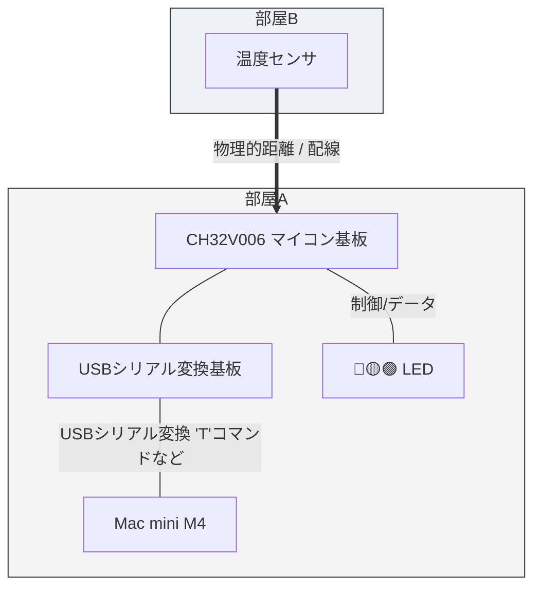
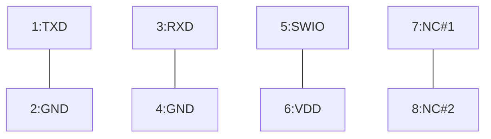

## Real Junk (マジ、くっだらねーっ)フィジカルAI実験システム

### 生成AIとの会話

#### AIエージェントとフィジカルAIはどう違う？

ここでちょっと確認しておきたいことがある。

最近「フィジカルAI」という言葉をよく聞く。人工知能にペリフェラルを持たせるという意味ではアタシがやろうとしている「組み込み屋から見たAIエージェント」と似ている気もする。明確に両者は違うものなのか、あるいはどちらかが片方を包含するものなのか。解説をお願いしたい。

#### AIエージェントとフィジカルAIの違い

「フィジカルAI」と、あなたがやろうとしている「組み込み屋から見たAIエージェント」は、方向性や目指す景色において非常に近い位置にありますが、** 明確な「包含関係」と「レイヤー（立ち位置）の違い」 ** があります。

結論から言うと、あなたが組もうとしているものは、まさに「フィジカルAIの最小構成（あるいはその核心）」そのものと言えます。両者の関係を、組み込み屋の視点で整理してみましょう。

1. 定義の整理：何が違うのか？
•	AIエージェント（抽象的な概念・脳の側面）
•	目標を与えられ、自ら思考し、計画を立て、ツール（APIや関数）を使いながらタスクを完結させる**「仕組み・アーキテクチャ」**全体を指します。
•	活躍場所は必ずしも現実世界とは限らず、PCの中（Excelの分析やメールの返信文作成など）のデジタル空間で完結することも多いです。
•	フィジカルAI（実体・物理世界の側面）
•	AIの知能（脳）が、現実世界（フィジカル空間）のセンサーやアクチュエータ（身体・ペリフェラル）と直結し、物理法則や摩擦・誤差を伴う環境で動くシステム全般を指します。
•	自動運転車、ヒューマノイド、工場内の自律搬送ロボット、そしてあなたがやっている「マイコン経由の温度センサ＆LED制御」も、まぎれもなくこの範疇に入ります。

2. どちらがどちらを包含するか？
構造としては、**「フィジカルAIは、AIエージェントの一形態（あるいはその超・実践的特化版）」**という関係に近いです。
•	AIエージェントという大きな枠組み（概念）があり、その「ツール」や「実行環境」の先が、WebのAPIやデータベースではなく、「現実世界のハードウェア（マイコンやモーター、センサー）」に向いたものが、昨今「フィジカルAI」と呼ばれています。
•	つまり、あなたがやろうとしていることは、AIエージェントの概念をデジタル空間のチャット画面から引きずり出し、シリアル通信という泥臭い物理レイヤーに接続する試みそのものです。世の中的に言えばまさに最先端の「フィジカルAI」の文脈に綺麗にハマります。

3. 組み込み屋から見た「フィジカルAI」の本質
バズワードとしての「フィジカルAI」は、大げさなヒューマノイドロボットや自動運転車をイメージさせがちですが、実態は昔から組み込み屋がやってきた**「センシングとフィードバック制御」の延長線上**にあります。
違いがあるとすれば、これまでは「人間が書いたif-elseの固いロジック」でセンサー値を受けてアクチュエータを動かしていた部分に、「LLMという、文脈を理解し、不確実な状況でも判断を下せる柔軟な脳ミソ」が組み込まれた点です。
CH32V006とMacをシリアルでつなぎ、「温度が高かったらどうするか」を定数で縛るのではなく、AIに判断させる――。まさにそのアプローチこそ、巨大な資本が動いている「フィジカルAI」の現場で起きてきていることの本質そのものと言えます。

#### プロジェクト概要

* プロジェクト名：Real Junc (略称：RJ, 日本語名：マジ、くっだらねーっ)
* 目的：組み込み屋らしく、リアルなハードウェアを用いてAIエージェントを理解する
* 発表：しない

#### 実験システムの構成図

#### マイコン基板の仕様

* CPU：CH32V006
* 信号経路：シリアル(UART) 115,200 baud
* エミュレータ<==>マイコン基板の接続

* マイコン基板シリアルコマンド一覧
|コマンド|意味|備考|
|-----|-----|-----|
| # | 休止(msec) | 変更可能 |
| #=n | 休止(msec)指定 | ex #=300 |
| R | 🔴赤LED点灯 |  |
| r | 🔴赤LED消灯 |  |
| Y | 🟡黄LED点灯 |  |
| y | 🟡黄LED消灯 |  |
| G | 🟢緑LED点灯 |  |
| g | 🟢緑LED消灯 |  |
| T | 温度測定 | TEMP = 23.43 C |

* コマンドは連続記述可能。改行まで解釈と実行を継続する。
* 例：200msec感覚で🔴赤LEDを3回点滅するコマンドは以下のとおり
* #=200R#r#R#r#R#r#<改行>
* コマンド応答にはデバッグメッセージが混じるので注意。LED系コマンドのデバッグメッセージは単に無視。Tコマンドの応答は先頭の 'TEMP = ' を手がかりにすること。
*
### rjloopLLM.py LLM(Local)を用いた室温評価ツール
* ツールの仕様に先立ってターミナルから ollama serve を実行するのを忘れないこと

#### 改良点1 プロンプトの外部化
--prompt-file プロンプト.txt で指定するか、python3 rj_loop.py < プロンプト.txt のようにパイプで流し込めば、ソースコードを一切触らずにプロンプトを差し替えられます。何も指定しなければデフォルトのテンプレートを使います。テンプレート内では {temperature} と {outdoor_temperature} の2つのプレースホルダーが使え、自由な言い回しで組み立てられます。

#### 改良点2 外気温の追加
Open-Meteo（APIキー不要）から現在地（習志野市付近に仮設定、緯度経度はWEATHER_LATITUDE/WEATHER_LONGITUDEで変更可）の気温を取得し、室温と一緒にLLMへ渡すようにしました。LLMには「LED色」に加えて「rising / falling / stable」という室温の傾向判断も同時に返させ、ログにも表示するようにしています。取得失敗時は"不明"として渡り、ループは止まらず継続します。

プロンプトの自作例

室内は{temperature:.2f}度、外は{outdoor_temperature}です。
28度を超えると私は暑いと感じ、外気温が室温より高いと今後さらに暑くなると考えます。
この感覚に基づいて判断してください。
color: <red/yellow/green>
trend: <rising/falling/stable>

### rjloopLLM_MCP.py
構造が大きく変わったので、変更点を整理します。

これまで（テキスト応答＋正規表現パース）
プロンプトで「color: を含む2行だけ返して」とお願いし、返ってきた自由文をPython側で正規表現でこじ開けて解釈していました。

今回（Function Calling）

get_temperatureとset_ledをdescription付きのツールとして定義（TOOLS）
LLMには温度の数値を渡さず、外気温の文脈だけ与えて「まず温度を確認してから、必要なら色を変えて」とだけ指示
LLMが自分の判断でget_temperatureを呼ぶ→Python側が実際にシリアルで温度を取得して結果を返す→LLMがその結果を見てset_ledを呼ぶ→Python側が実際にLEDを切り替える、という**往復（run_agent_step）**をLLM自身が組み立てます
Python側（tool_get_temperature/tool_set_led）は「呼ばれた通りに実行して結果を返すだけ」の実行係に徹しています
無限ループ防止のためMAX_AGENT_TURNSで往復回数に上限を設けています

一番の違いは、「温度を確認するかどうか」自体もLLMの判断に委ねた点です。以前は「Pythonが先に温度を取ってからLLMに渡す」固定順序でしたが、今回はLLMが「まず温度を見るべきだ」と自分で判断してツールを呼ぶところから始まります。実際に動かしてみると、[ツール実行] get_temperature({}) -> {...}のようなログが先に出て、その後にset_ledが呼ばれる様子が見えるはずです。

#### 実行結果(呼び出し側の言いなりではなくLLMの判断でtoolを呼び出し、LEDの点灯も判断している)

hidetokanoshima@Mac-mini toolsMCP % python3 rjloopLLM_MCP.py 
接続しました: /dev/tty.usbmodemBDD28F0643042 @ 115200bps
外気温: 22.6度
  [ツール実行] get_temperature({}) -> {'temperature_celsius': 23.81}
  [ツール実行] set_led({'color': 'green'}) -> {'result': 'ok', 'color': 'green'}
エージェントの報告: 室温が23.81℃であったため、通常の範囲内と判断し、LEDを緑（green）に設定しました。
外気温: 22.6度
  [ツール実行] get_temperature({}) -> {'temperature_celsius': 23.75}
  [ツール実行] set_led({'color': 'green'}) -> {'result': 'ok', 'color': 'green'}
エージェントの報告: 室温が23.75℃であったため、平常を示す緑色（green）のLEDに切り替えました。
外気温: 22.6度
  [ツール実行] get_temperature({}) -> {'temperature_celsius': 23.68}
  [ツール実行] set_led({'color': 'green'}) -> {'result': 'ok', 'color': 'green'}
エージェントの報告: 室温が23.68℃であったため、適切な状態であると判断し、LEDを緑色に点灯させました。
^C
終了します。全LED消灯。
hidetokanoshima@Mac-mini toolsMCP % 
