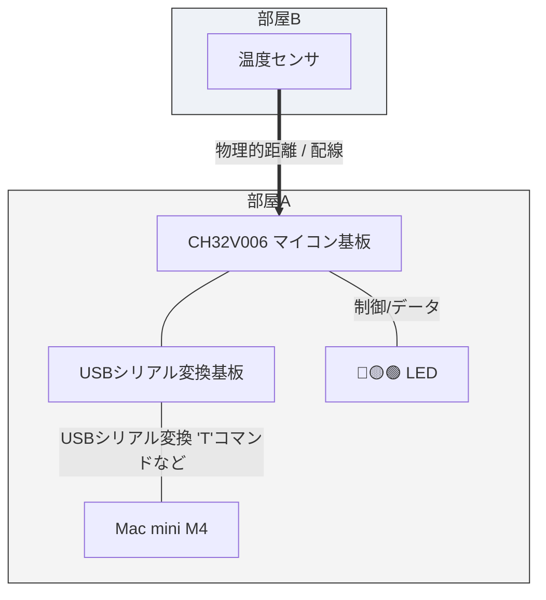

## Real Junk くっだらねーっフィジカルAI実験システム

#### AIエージェントとフィジカルAIはどう違う？

ここでちょっと確認しておきたいことがある。

最近「フィジカルAI」という言葉をよく聞く。人工知能にペリフェラルを持たせるという意味ではアタシがやろうとしている「組み込み屋から見たAIエージェント」と似ている気もする。明確に両者は違うものなのか、あるいはどちらかが片方を包含するものなのか。解説をお願いしたい。

#### AIエージェントとフィジカルAIの違い

「フィジカルAI」と、あなたがやろうとしている「組み込み屋から見たAIエージェント」は、方向性や目指す景色において非常に近い位置にありますが、** 明確な「包含関係」と「レイヤー（立ち位置）の違い」 ** があります。

結論から言うと、あなたが組もうとしているものは、まさに「フィジカルAIの最小構成（あるいはその核心）」そのものと言えます。両者の関係を、組み込み屋の視点で整理してみましょう。

1. 定義の整理：何が違うのか？
•	AIエージェント（抽象的な概念・脳の側面）
•	目標を与えられ、自ら思考し、計画を立て、ツール（APIや関数）を使いながらタスクを完結させる**「仕組み・アーキテクチャ」**全体を指します。
•	活躍場所は必ずしも現実世界とは限らず、PCの中（Excelの分析やメールの返信文作成など）のデジタル空間で完結することも多いです。
•	フィジカルAI（実体・物理世界の側面）
•	AIの知能（脳）が、現実世界（フィジカル空間）のセンサーやアクチュエータ（身体・ペリフェラル）と直結し、物理法則や摩擦・誤差を伴う環境で動くシステム全般を指します。
•	自動運転車、ヒューマノイド、工場内の自律搬送ロボット、そしてあなたがやっている「マイコン経由の温度センサ＆LED制御」も、まぎれもなくこの範疇に入ります。

2. どちらがどちらを包含するか？
構造としては、**「フィジカルAIは、AIエージェントの一形態（あるいはその超・実践的特化版）」**という関係に近いです。
•	AIエージェントという大きな枠組み（概念）があり、その「ツール」や「実行環境」の先が、WebのAPIやデータベースではなく、「現実世界のハードウェア（マイコンやモーター、センサー）」に向いたものが、昨今「フィジカルAI」と呼ばれています。
•	つまり、あなたがやろうとしていることは、AIエージェントの概念をデジタル空間のチャット画面から引きずり出し、シリアル通信という泥臭い物理レイヤーに接続する試みそのものです。世の中的に言えばまさに最先端の「フィジカルAI」の文脈に綺麗にハマります。

3. 組み込み屋から見た「フィジカルAI」の本質
バズワードとしての「フィジカルAI」は、大げさなヒューマノイドロボットや自動運転車をイメージさせがちですが、実態は昔から組み込み屋がやってきた**「センシングとフィードバック制御」の延長線上**にあります。
違いがあるとすれば、これまでは「人間が書いたif-elseの固いロジック」でセンサー値を受けてアクチュエータを動かしていた部分に、「LLMという、文脈を理解し、不確実な状況でも判断を下せる柔軟な脳ミソ」が組み込まれた点です。
CH32V006とMacをシリアルでつなぎ、「温度が高かったらどうするか」を定数で縛るのではなく、AIに判断させる――。まさにそのアプローチこそ、巨大な資本が動いている「フィジカルAI」の現場で起きてきていることの本質そのものと言えます。

#### 実験システムの構成図

    